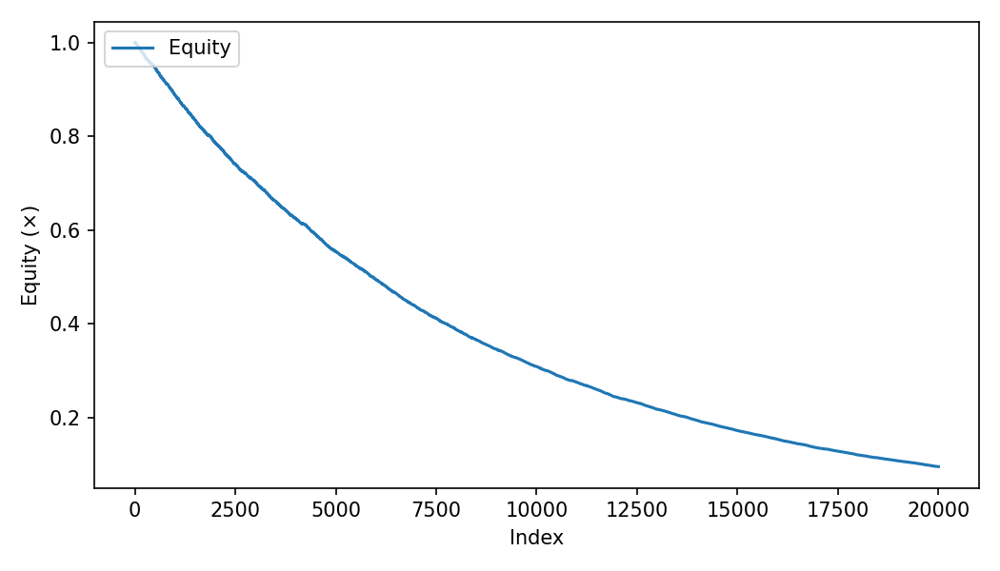

# Intraday Micro-Backtest (Mean-Reversion)

> Vectorised NumPy/pandas micro-backtest with transaction costs, JSON metrics, and saved artefacts (plots + params).

## Overview
This repo demonstrates a minimal, **reproducible** intraday mean-reversion backtest. It focuses on:
- **Vectorised** signal & P&L computation (no Python loops)
- **Costs model** (fees + slippage) included in P&L
- A **CLI** that prints **JSON metrics** to stdout and saves run artefacts
- **Plots**: equity curve (+ drawdown) saved per run
- **Tests & CI**: pytest + linting on GitHub Actions

> Educational project — not investment advice.

---

## Quickstart (reproducible)

```bash
python -m venv .venv && source .venv/bin/activate
pip install -r requirements.txt
pip install -e .

# Run with sane defaults:
imb --n 20000 --seed 0 --window 20 --entry-z 1.0 --exit-z 0.2 --fee-bps 1 --slip-bps 2
# Artefacts saved under runs/YYYYmmdd-HHMMSS/
```

Alternative (without console script):
```bash
python -m intraday_micro_backtest.cli --n 20000 --seed 0
```

---

## CLI usage

```bash
imb --help

imb --n 20000 --seed 0     --window 20 --entry-z 1.0 --exit-z 0.2     --fee-bps 1 --slip-bps 2     --outdir runs/$(date +%Y%m%d-%H%M%S)
```

Artefacts per run:
```
runs/<timestamp>/
  ├─ metrics.json        # throughput, latency, sharpe, max drawdown
  ├─ params.json         # CLI params used
  └─ equity_drawdown.png # plot (equity + drawdown)
```

---

## Results (on my machine)

| Metric                   | Value       | Notes                                   |
|--------------------------|-------------|-----------------------------------------|
| Throughput (rows/sec)    | **1,339,844** | n = 20,000 synthetic rows               |
| Latency (sec)            | **0.014927**  | end-to-end run                          |
| Sharpe (annualised)      | **-10.5154**  | synthetic random walk + costs           |
| Max Drawdown             | **-0.9043**   | on synthetic series                     |

**Command used**
```bash
imb --n 20000 --seed 0 --window 20 --entry-z 1.0 --exit-z 0.2 --fee-bps 1 --slip-bps 2
```

**Artefacts**
- `runs/20250814-201640/metrics.json`  
- `runs/20250814-201640/params.json`  
- Plot:  
  

**Notes**
- This demo uses a **synthetic random walk**. With costs enabled, simple mean-reversion can show large drawdowns and negative Sharpe.
- The Sharpe shown is **annualised**. For intraday step data, consider also reporting **per-step Sharpe** or calibrating annualisation to the sampling interval.

> Tip: For a nicer demo while staying honest, try `--fee-bps 0 --slip-bps 0`, `--entry-z 1.2 --exit-z 0.4`, or a different `--seed` and paste the new metrics.

---

## Testing & CI

```bash
pytest -q
```

- Invariant tests guard against **look-ahead bias** and ensure **costs reduce P&L**.
- GitHub Actions runs **black/isort/pytest** on push and PRs.

---

## Project structure

```
intraday_micro_backtest/
├── src/intraday_micro_backtest/
│   ├── backtest.py       # generate data, signal, P&L
│   ├── cli.py            # CLI entrypoint (prints JSON; saves artefacts)
│   ├── plotting.py       # save equity + drawdown plot
│   └── __init__.py
├── tests/
│   ├── test_backtest.py
│   └── test_invariants.py
├── requirements.txt
├── pyproject.toml
├── setup.cfg
└── README.md
```

---

## Next steps (ideas)
- Add a small **daily OHLC** CSV example alongside synthetic data.
- Add a **param sweep** script (window / entry-z) that emits a Markdown results table.
- Report **per-step Sharpe** and/or scale annualisation by sampling interval.
- Save plots to a stable path (`docs/figures/`) for README linking; ignore `runs/` in `.gitignore`.

---

**License:** MIT

